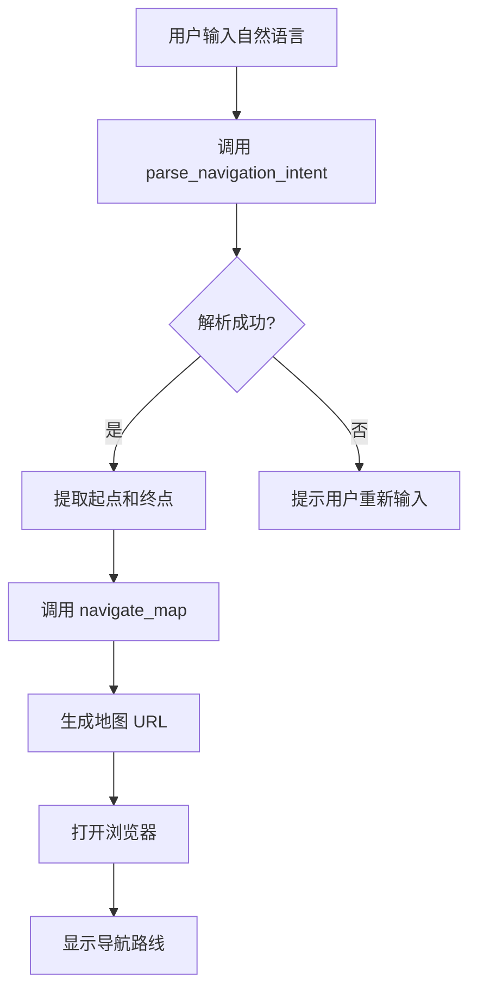
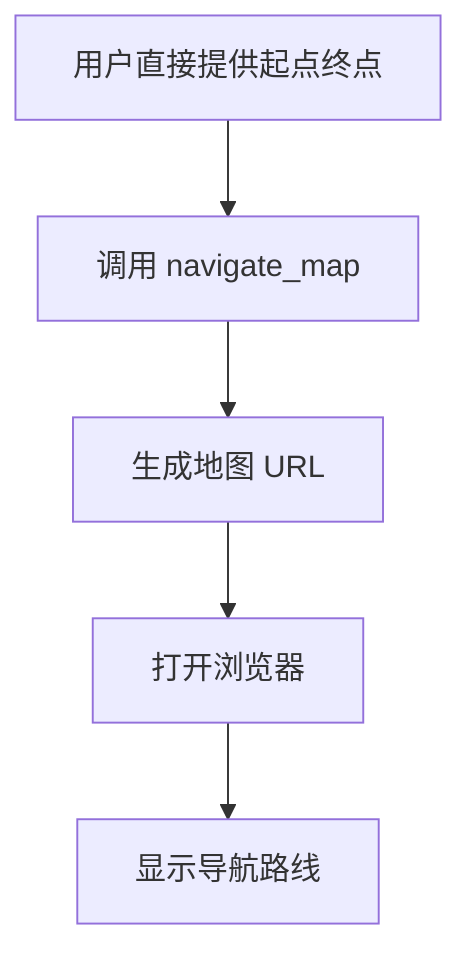

# API 文档

## MCP 服务器信息

- **名称**: map-navigation-mcp
- **版本**: 1.0.0
- **协议**: MCP (Model Context Protocol)
- **传输方式**: stdio

## 工具列表

### 1. navigate_map

打开地图应用并开始从起点到终点的导航。

#### 请求参数

```json
{
  "name": "navigate_map",
  "arguments": {
    "start": "string",        // 必需：起点地址
    "end": "string",          // 必需：终点地址
    "mapProvider": "string"   // 可选：地图提供商 (baidu|amap)
  }
}
```

#### 参数说明

| 参数 | 类型 | 必需 | 说明 | 默认值 | 示例 |
|------|------|------|------|--------|------|
| start | string | 是 | 导航起点地址或地点名称 | - | "北京天安门" |
| end | string | 是 | 导航终点地址或地点名称 | - | "上海东方明珠" |
| mapProvider | string | 否 | 地图提供商 | "baidu" | "baidu" 或 "amap" |

#### 响应示例

**成功响应：**

```json
{
  "content": [
    {
      "type": "text",
      "text": "✅ 成功打开 百度地图\n\n📍 起点：北京天安门\n📍 终点：上海东方明珠\n🔗 导航链接：https://map.baidu.com/?da_src=shareurl&origin=北京天安门&destination=上海东方明珠&output=html&da_mode=transit\n\n地图应用已在浏览器中打开，正在准备导航..."
    }
  ]
}
```

**错误响应：**

```json
{
  "content": [
    {
      "type": "text",
      "text": "❌ 错误: 起点和终点不能为空"
    }
  ],
  "isError": true
}
```

#### 生成的 URL 格式

**百度地图：**
```
https://map.baidu.com/?da_src=shareurl&origin={起点}&destination={终点}&output=html&da_mode=transit
```

**高德地图：**
```
https://www.amap.com/dir?from={起点}&to={终点}
```

---

### 2. parse_navigation_intent

从自然语言文本中提取导航意图，识别起点和终点。

#### 请求参数

```json
{
  "name": "parse_navigation_intent",
  "arguments": {
    "text": "string"  // 必需：用户输入的自然语言文本
  }
}
```

#### 参数说明

| 参数 | 类型 | 必需 | 说明 | 示例 |
|------|------|------|------|------|
| text | string | 是 | 用户输入的自然语言文本 | "从北京到上海" |

#### 支持的输入格式

| 格式 | 示例 | 提取结果 |
|------|------|----------|
| 从A到B | "从北京到上海" | 起点: 北京, 终点: 上海 |
| 从A去B | "从天安门去东方明珠" | 起点: 天安门, 终点: 东方明珠 |
| A到B导航 | "北京到上海导航" | 起点: 北京, 终点: 上海 |
| 帮我从A到B | "帮我从北京到上海" | 起点: 北京, 终点: 上海 |
| 去B | "去杭州西湖" | 起点: null, 终点: 杭州西湖 |
| 到B | "到上海浦东机场" | 起点: null, 终点: 上海浦东机场 |

#### 响应示例

**成功识别起点和终点：**

```json
{
  "content": [
    {
      "type": "text",
      "text": "🔍 导航意图解析结果：\n\n起点：北京天安门\n终点：上海东方明珠\n置信度：90%\n\n✅ 起点和终点已成功识别\n💡 建议：可以使用 navigate_map 工具开始导航\n\n示例调用：\n{\n  \"start\": \"北京天安门\",\n  \"end\": \"上海东方明珠\",\n  \"mapProvider\": \"baidu\"\n}"
    }
  ]
}
```

**只识别到终点：**

```json
{
  "content": [
    {
      "type": "text",
      "text": "🔍 导航意图解析结果：\n\n起点：未指定\n终点：杭州西湖\n置信度：70%\n\n⚠️ 只识别到终点，起点未指定\n💡 建议：请补充起点信息，或使用当前位置作为起点"
    }
  ]
}
```

**未能识别：**

```json
{
  "content": [
    {
      "type": "text",
      "text": "🔍 导航意图解析结果：\n\n起点：未指定\n终点：未指定\n置信度：0%\n\n❌ 未能识别有效的导航信息\n💡 建议：请使用类似\"从A到B\"或\"去某地\"的表达方式"
    }
  ]
}
```

## 内部数据结构

### NavigationIntent

```go
type NavigationIntent struct {
    Start      *string  // 起点（可为 nil）
    End        *string  // 终点（可为 nil）
    Confidence float64  // 置信度 (0.0 - 1.0)
}
```

### NavigationParams

```go
type NavigationParams struct {
    Start       string      // 起点
    End         string      // 终点
    MapProvider MapProvider // 地图提供商
}
```

### MapProvider

```go
type MapProvider string

const (
    Baidu MapProvider = "baidu"  // 百度地图
    Amap  MapProvider = "amap"   // 高德地图
)
```

## 错误代码

| 错误信息 | 原因 | 解决方案 |
|----------|------|----------|
| 起点和终点不能为空 | start 或 end 参数缺失或为空 | 提供有效的起点和终点 |
| 不支持的地图提供商 | mapProvider 值不在允许范围内 | 使用 "baidu" 或 "amap" |
| 打开地图失败 | 浏览器启动失败 | 检查系统默认浏览器设置 |
| 请提供有效的文本输入 | text 参数为空 | 提供有效的文本字符串 |

## 使用流程

### 典型的完整流程



### 简化流程（直接调用）



## 性能指标

- **启动时间**: < 100ms
- **响应时间**: < 500ms
- **内存占用**: < 20MB
- **并发支持**: 单实例（stdio 传输）

## 兼容性

- **操作系统**: macOS, Windows, Linux
- **Go 版本**: >= 1.21
- **浏览器**: 任何现代浏览器
- **MCP 客户端**: Claude Desktop, 其他支持 MCP 的客户端

## 安全性

- 不收集用户数据
- 不存储历史记录
- 所有操作在本地执行
- 仅打开用户授权的 URL
